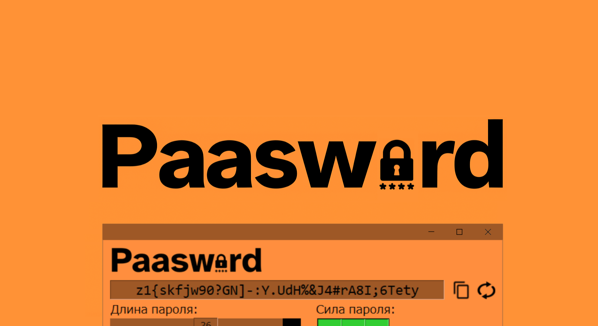

<h1 align="center">
  
</h1>

<h1 align="center">
  Tkinter App Template: Paasword
</h1>

<div align="center">
  
  [](#)
  [](#)
  [](https://github.com/n1xsi/paasword-tkinter/blob/main/LICENSE)
  
</div>

Многофункциональный генератор паролей «Paasword» — это проект-шаблон для создания десктопных приложений на Python с использованием библиотеки Tkinter. 

## 🎯 Зачем нужен этот проект?

Цель этого репозитория — быть **стартовым шаблоном**.

*   **Для новичков:** Этот проект наглядно демонстрирует, как правильно структурировать приложение, избегая «спагетти-кода» в одном файле.
*   **Для опытных разработчиков:** Это быстрый старт для прототипирования (или создания небольших утилит), позволяющий сразу сфокусироваться на логике, а не на базовой обвязке.
*   **Для всех:** Это пример того, как сделать стандартный интерфейс Tkinter более привлекательным и современным с помощью тем, изображений и правильного расположения элементов.

## ✨ Возможности шаблона

Этот проект-шаблон предлагает готовую архитектуру и набор решений для ключевых задач, с которыми сталкивается каждый разработчик десктопных приложений:

*   **🧱 Чёткая архитектура:** Код разделен на логические модули (`ui.py`, `logic.py`, `constants.py`, `utils.py`), что упрощает навигацию, поддержку и масштабирование проекта.
*   **🎨 Разделение логики и представления:**
    *   `ui.py` отвечает только за то, *как выглядит* приложение.
    *   `logic.py` отвечает за то, *что делает* приложение.
    *   Такой подход позволяет изменять внешний вид, не затрагивая логику, и наоборот.
*   **🖼️ Управление ресурсами:** Продемонстрирована работа с изображениями и иконками. Функция `utils.py` корректно находит пути к ресурсам как при запуске из исходников, так и в собранном `.exe` файле.
*   **⚙️ Реактивный интерфейс:** Показано, как связывать виджеты с логикой с помощью переменных Tkinter (`StringVar`, `BooleanVar`) и их отслеживания (`trace`), создавая динамический пользовательский опыт.
*   **📦 Готовность к распространению:** Включает простую и понятную инструкцию по сборке проекта в один исполняемый `.exe` файл с помощью PyInstaller, который будет работать на любом компьютере с Windows.
*   **📜 Качественная документация:** Код снабжен комментариями и docstrings, а `README.md` содержит всю необходимую информацию для быстрого старта.

## 🚀 Запуск

### 1. Клонирование репозитория
```bash
git clone https://github.com/[Имя-Пользователя]/[Имя-Репозитория].git
cd [Имя-Репозитория]
```

### 2. Создание виртуального окружения (если требуется)
```bash
# Для Windows
python -m venv venv
venv\Scripts\activate

# Для macOS/Linux
python3 -m venv venv
source venv/bin/activate
```

### 3. Установка зависимостей (если выполнен пункт 2)
```bash
pip install -r requirements.txt
```

### 4. Запуск приложения
```bash
python main.py
```

## 📦 Сборка в единый .exe файл
Чтобы собрать проект в один исполняемый файл, который будет работать на Windows даже без установленного Python, используйте PyInstaller.
Выполните команду в терминале, находясь в корневой папке проекта:
```bash
pyinstaller --name Paasword --onefile --windowed --icon="assets/images/logo.ico" --add-data="assets;assets" main.py
```
Готовый файл «Paasword.exe» появится в папке dist.

## ⚙️ Функционал приложения-примера (использование)

Генератор паролей, реализованный в данном шаблоне, демонстрирует следующие возможности:

*   **Настраиваемая длина:** Длину пароля можно легко изменить с помощью слайдера.
*   **Гибкие наборы символов:** Пользователь может включать/выключать:
    *   Прописные буквы (a-z)
    *   Заглавные буквы (A-Z)
    *   Цифры (0-9)
    *   Специальные символы (!, @, #, ...)
*   **Дополнительные опции:**
    *   **"Начинать с буквы"**: Гарантирует, что пароль не начнется с буквы.
    *   **"Без повтора символов"**: Создаёт пароль, в котором каждый символ уникален.
    *   **"Исключить похожие"**: Убирает из набора символы, которые можно перепутать (например, `l` и `1`, `O` и `0`).
*   **Пресеты:** Для быстрого выбора настроек доступны готовые пресеты:
    *   `Полная защита`: Максимально криптостойкий пароль.
    *   `Легко читается`: Без спецсимволов и похожих символов.
    *   `Легко сказать`: Только буквы, без цифр и спецсимволов.
    *   `PIN-код`: Короткий пароль только из цифр.
    *   `Свой`: Автоматически выбирается при ручном изменении любой настройки.
*   **Индикатор силы пароля:** Визуально оценивает надежность пароля на основе его длины и разнообразия символов.
*   **Копирование в буфер обмена:** Удобная кнопка для мгновенного копирования сгенерированного пароля.

## 📂 Структура проекта
```
Paasword/
├── app/             # Основной пакет приложения
│ ├── __init__.py    # Делает директорию 'app' пакетом Python
│ ├── ui.py          # Модуль интерфейса (класс PasswordGeneratorUI)
│ ├── logic.py       # Модуль логики (класс PasswordGeneratorApp)
│ ├── constants.py   # Модуль с константами и конфигурациями
│ └── utils.py       # Вспомогательные утилиты (направление для путей к ресурсам)
│
├── assets/          # Папка для всех ресурсов
│ └── images/        # Изображения для UI
│
├── main.py          # Точка входа в приложение
├── .gitignore       # Файл для игнорирования ненужных файлов Git
├── LICENSE          # Лицензия проекта (MIT)
└── README.md        # Данный файл (оформление GitHub проекта)
```

## 📄 Лицензия
Этот проект распространяется под лицензией MIT. Подробности смотрите в файле [LICENSE](https://github.com/n1xsi/paasword-tkinter/blob/main/LICENSE "MIT License").
